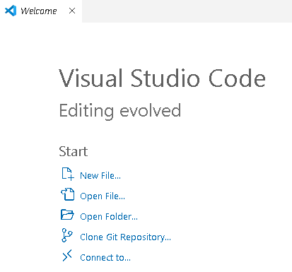
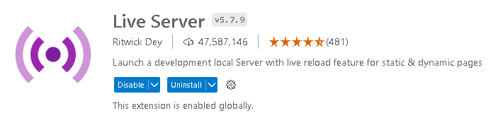

# Проект по дисциплине "Теория виртуальной и дополненной реальности" Three.js

## Описание

Дисциплина "Теория виртуальной и дополненной реальности" является обязательной для изучения по программе подготовки ФГБОУ ВО "СамГТУ" 09.03.04 Программная инженерия.  

## Выполнили студенты 3-ИАИТ-109:
* Ермолин Константин Павлович
* Малышев Максим Александрович
* Мурыгин Дмитрий Алексеевич 

## Стек технологий:
* [Live Server v5.7.9](https://marketplace.visualstudio.com/items?itemName=ritwickdey.LiveServer)
* [MediaPipe Handpose](https://github.com/tensorflow/tfjs-models/tree/master/handpose)
* [Three JS v0.155.0](https://github.com/mrdoob/three.js)
* [Tensorflow JS (tfjs)](https://github.com/tensorflow/tfjs)
* [HTML5-QRCode v2.3.8](https://github.com/mebjas/html5-qrcode)

## Использование проекта:
1. Склонировать данный репозиторий к себе на устройство (New Window - Clone Git Repository)

2. Скачать дополнение к Visual Studio Code - ["Live Server"](https://marketplace.visualstudio.com/items?itemName=ritwickdey.LiveServer)

3. Перейти в файл разметки index.html
4. Запустить его с помощью кнопки "Go Live" в правом нижнем углу экрана
